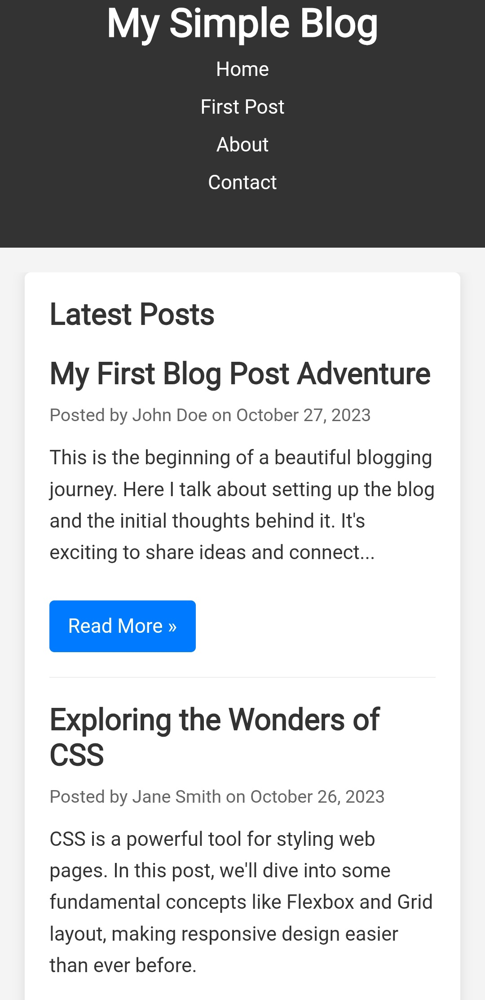

# 📝 Simple Blog Layout Website

A clean and responsive blog layout website built using HTML and CSS.  
This project represents a modern blog interface with well-structured sections for articles, headings, and content display.

## 🚀 Live Demo
🔗 https://alakhhawk47.github.io/Simple-Blog-Layout/

## 📌 Features
- Clean blog-style layout
- Responsive design for all devices
- Well-structured article sections
- Modern typography and spacing
- Simple and elegant UI
- Beginner-friendly project

## 🛠️ Tech Stack
- HTML5
- CSS3
- Netlify (Deployment)

## 📂 Project Structure
Simple-Blog-Layout
│── index.html
│── style.css
│── images/

## 📷 Screenshot

## 💻 How to Run Locally
1. Clone this repository  
2. Open the project folder  
3. Open `index.html` in browser  

## 🌱 Learning Purpose
This project was built to practice creating structured blog layouts and improving frontend design skills using HTML and CSS.

## 👨‍💻 Author
**Alakh Raj Singh**  
B.Tech EC – JSS Academy of Technical Education, 

## GitHub: 
🔗 https://github.com/alakhhawk47
